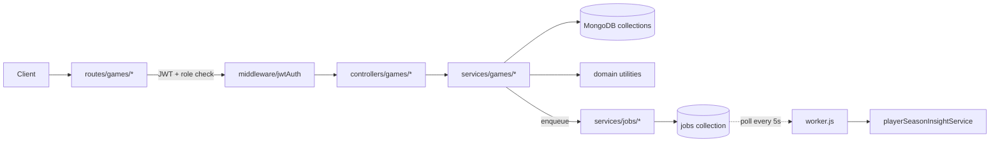

# Squad Up — Youth Soccer Management Platform

> Full-stack web application for managing youth soccer teams — games, players, training, and analytics.

---

<!-- Replace this line with your demo GIF once captured:

-->

> **Demo screenshots below.** A screen recording will be added here shortly.

---

## What it is

Squad Up gives youth soccer coaches and administrators a single platform to run their entire season:
schedule fixtures, plan lineups on a drag-and-drop tactical board, track live match events (goals,
substitutions, cards), submit post-match reports, and surface player development insights over time.

Built as a solo project to demonstrate full-stack engineering from data modeling through deployment,
using a **spec-driven AI-augmented workflow** throughout.

---

## Highlights

- **Architected and built end-to-end** — owned every layer from MongoDB schema design and REST API
  architecture through React frontend and production deployment.

- **Engineered a transactional match-event engine** — a `Scheduled → Played → Done` game lifecycle
  state machine with multi-collection MongoDB transactions, a business-rule eligibility validator
  (player-state-at-minute, rolling substitutions, card progression + future-consistency checks), and
  a MongoDB-backed background job queue with atomic locking and exponential-backoff retries that
  decouples heavy analytics recalculations from API response time.

- **Built a modular React 18 frontend in Feature-Sliced Design** — with ESLint-enforced module
  boundaries, a drag-and-drop tactical lineup board, debounced autosave for drafts, React Query
  server-state caching, organization-scoped feature flags, and a player development analytics
  dashboard that turns raw match data into coaching insights.

---

## Tech stack

| Layer | Technology |
|-------|-----------|
| Backend | Node.js 18 + Express 4 |
| Database | MongoDB Atlas (18 collections) |
| Auth | JWT + bcrypt (4-role RBAC) |
| Frontend | React 18 + Vite 5 |
| Styling | Tailwind CSS |
| State | React Context + custom hooks |
| Testing | Jest (backend, 98 tests) + Playwright (E2E) |
| Logging | pino structured JSON logging |
| Architecture | MVC + Domain-Driven Design (backend), Feature-Sliced Design (frontend) |

---

## System architecture

---

## Key engineering decisions

### 1. Game lifecycle as a state machine

Every game moves through a strict status sequence: `Scheduled → Played → Done` (or `Postponed`).
Each transition is guarded server-side:

- **Scheduled → Played:** requires exactly 11 players in valid formation positions with a goalkeeper; creates `GameRoster` records in a MongoDB transaction; enqueues `recalc-minutes` job.
- **Played → Done:** server calculates `minutesPlayed`, `goals`, and `assists` from events (clients cannot send these); persists all player reports; triggers goal and substitution analytics recalculation; enqueues `recalc-player-season-insights` job with 10-second delay.

See [docs/prd.md](docs/prd.md) for all 26 business rules enforced by the system.

### 2. MongoDB-backed job queue

Heavy recalculations (player minutes, season insights, goal analytics) are decoupled from API
responses via a MongoDB-based job queue:

- **Atomic locking:** `findOneAndUpdate` atomically claims jobs (`pending → running`) — no double-processing even under concurrent workers.
- **Deduplication:** `recalc-minutes` jobs use `$setOnInsert` upsert so rapid event mutations collapse into one pending job, not N.
- **Reliability:** failed jobs are retried up to 3 times with exponential backoff; completed jobs are auto-deleted after 30 days via TTL index.

See [docs/architecture.md](docs/architecture.md) for the full architecture and sequence diagrams.

### 3. Feature-Sliced Design with ESLint enforcement

The React frontend is organized by business domain (features), not by technical layer. An ESLint
plugin enforces that features cannot import from other features — all shared code must go through
`shared/`. This means:

- Adding or changing a feature never accidentally breaks another
- The dependency graph stays flat and predictable
- Component decomposition is enforced: the `game-execution` feature's root container wires
  together 17 custom hooks and 5 layout modules, with zero business logic in the layout layer

See [docs/frontend.md](docs/frontend.md) for the full component hierarchy and hook breakdown.

### 4. Spec-driven AI-augmented development

This project was built using a structured AI-augmented workflow where each feature domain has a
co-located spec bundle (PRD + architecture doc + AGENTS navigation map) that keeps AI tooling
grounded in the real codebase. This prevents context collapse as the system grows and allows
reliable implementation of complex business rules.

See [docs/ai-workflow.md](docs/ai-workflow.md) for a detailed explanation of the workflow.

---

## Screenshots

> Screenshots will be added here once captured from the running application.
> Planned: tactical board, live game view, player development timeline, analytics dashboard.

<!--

-->

---

## Documentation

| Document | Contents |
|----------|----------|
| [docs/prd.md](docs/prd.md) | Product requirements — lifecycle, business rules, feature flags |
| [docs/architecture.md](docs/architecture.md) | Backend internals — module map, request flows, job queue design |
| [docs/frontend.md](docs/frontend.md) | Frontend architecture — FSD structure, hooks, state management |
| [docs/ai-workflow.md](docs/ai-workflow.md) | AI-augmented development workflow |

---

## Source code

The source code is private. Available on request for serious inquiries — feel free to reach out.

---

## License

Copyright (c) 2026 Tal Solomon. All Rights Reserved. See [LICENSE](LICENSE).
