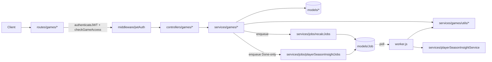

# Games — Backend Architecture

> For product behavior see [prd.md](prd.md). For frontend UI internals see [frontend.md](frontend.md).

---

## Module overview

```
backend/src/
├── routes/games/                        Sub-router aggregator + 13 leaf route files
│   └── index.js                         Mounts all leaf routes under /api/games
├── controllers/games/                   Thin HTTP adapters (9 files)
├── services/games/                      Business logic
│   ├── gameService.js                   Orchestrator (CRUD, drafts, start, finalize, realtime stats)
│   ├── goalService.js                   Goal CRUD (TeamGoal + OpponentGoal discriminators)
│   ├── cardService.js                   Card CRUD with progression + future-consistency checks
│   ├── substitutionService.js           Substitution CRUD with rolling-subs support
│   ├── gameReportService.js             Game report CRUD + server-authoritative batch upsert
│   ├── playerMatchStatsService.js       Per-player ratings (fouls/shooting/passing/duels)
│   ├── difficultyAssessmentService.js   Pre-game difficulty (Scheduled-only)
│   ├── gameRosterService.js             Game roster CRUD
│   ├── minutesValidationService.js      Match duration update
│   └── utils/                           Domain helpers — see "Service utilities" below
├── services/jobs/                       Job enqueue helpers (deduped)
│   ├── recalcJobs.js                    enqueueRecalcMinutesForGame (atomic upsert dedupe)
│   └── playerSeasonInsightJobs.js       enqueuePlayerSeasonInsightRecalcForGame (Done-only)
├── worker.js                            Polling worker — recalc-minutes + recalc-player-season-insights
├── middleware/jwtAuth.js                Auth + role + scope middleware (with LRU cache)
└── models/                              Game, Goal, Card, Substitution, GameRoster, GameReport, PlayerMatchStat, Job
```

### Service utilities

| File | Role |
|------|------|
| `utils/gameRules.js` | Player state machine + eligibility validators (`validateGoalEligibility`, `validateCardEligibility`, `validateSubstitutionEligibility`, `validateFutureConsistency`, `getPlayerStateAtMinute`) |
| `utils/gameEventsAggregator.js` | `getMatchTimeline` — parallel fetch of Goals/Cards/Substitutions, normalized + sorted by minute |
| `utils/minutesCalculation.js` | Session-based minutes algorithm + `updatePlayedStatusForGame` |
| `utils/minutesValidation.js` | `validateExtraTime`, `calculateTotalMatchDuration` |
| `utils/goalAnalytics.js` | `recalculateGoalAnalytics` — assigns `goalNumber` + per-goal `matchState` on Done |
| `utils/substitutionAnalytics.js` | `recalculateSubstitutionAnalytics` — per-sub `matchState` on Done |
| `utils/goalsAssistsCalculation.js` | `calculatePlayerGoalsAssists` — per-player aggregation |

---

## System architecture



---

## Key flow: Start Game (Scheduled → Played)

This is the most architecturally interesting flow — it spans every layer:
auth + scope middleware → controller → service-wrapped transaction → multi-collection
writes → post-commit job enqueue.

```mermaid
sequenceDiagram
  participant Client
  participant Auth as middleware/jwtAuth
  participant Ctrl as controllers/games/gameController
  participant Svc as services/games/gameService
  participant DB as MongoDB
  participant Jobs as services/jobs/recalcJobs
  participant Worker as worker.js

  Client->>Auth: POST /api/games/:gameId/start-game
  Auth->>DB: Verify JWT + check game access
  Auth-->>Ctrl: req.user + req.game attached
  Ctrl->>Svc: startGame(gameId, {rosters, formation})
  Svc->>Svc: validateFormationStructure(formation)
  Svc->>DB: startSession() / startTransaction()
  Svc->>DB: game.status = 'Played'; game.lineupDraft = undefined
  loop Each roster entry
    Svc->>DB: GameRoster.findOneAndUpdate(upsert)
  end
  Svc->>DB: commitTransaction()
  Svc->>Jobs: enqueueRecalcMinutesForGame(gameId)
  Jobs->>DB: Job.findOneAndUpdate(upsert dedupe)
  Svc-->>Ctrl: { game, gameRosters }
  Ctrl-->>Client: 200 { success: true, data: {...} }

  Note over Jobs,Worker: Worker picks up job within 5s
  Worker->>DB: Job.findAndLock() (atomic pending→running)
  Worker->>Svc: recalculatePlayerMinutes(gameId)
```

---

## Background job queue

The worker uses MongoDB as a job queue with atomic locking to prevent double-processing:

```
Job lifecycle:
  pending → running → completed (auto-deleted after 30 days via TTL index)
                    → failed    (retried with exponential backoff, max 3 attempts)

Deduplication: recalc jobs use findOneAndUpdate with $setOnInsert so rapid event
mutations (e.g. 5 goals added quickly) collapse into a single pending job.
```

### Job types

| Job type | Produced when | Consumed by |
|----------|---------------|-------------|
| `recalc-minutes` | Game starts (Scheduled→Played); any sub/card mutation | Worker → `minutesCalculation` service |
| `recalc-player-season-insights` | Game transitions to Done; any event mutation on a Done game | Worker → `playerSeasonInsightService` |

---

## Database schema (18 collections)

```
squadup (database)
├── Core Domain
│   ├── users, teams, players, games
│
├── Match Events
│   ├── goals  (discriminators: TeamGoal, OpponentGoal)
│   ├── substitutions, cards
│
├── Match Data
│   ├── game_reports, gamerosters, formations, playermatchstats
│
├── Training
│   ├── drills, sessiondrills, trainingsessions
│
├── Analysis
│   ├── scout_reports, timeline_events
│
└── System
    ├── jobs, organization_configs
```

---

## API surface

All routes under `/api/games` require JWT authentication. Role-based scope checks run in middleware before any controller logic executes.

**Game lifecycle:**
- `POST /api/games` — create game
- `POST /api/games/:id/start-game` — Scheduled → Played (validates 11-player formation)
- `POST /api/games/:id/submit-report` — Played → Done (persists all reports, triggers analytics)

**Match events (all under `/api/games/:gameId/`):**
- `/goals`, `/substitutions`, `/cards` — full CRUD with eligibility validation on every write
- `/timeline` — unified chronological event feed
- `/player-stats` — real-time minutes/goals/assists (Played/Done only)

**Drafts:**
- `GET/PUT /api/games/:id/draft` — autosave endpoint for lineup (Scheduled) and report (Played) drafts

**Total API surface:** 150+ endpoints across all domains.
