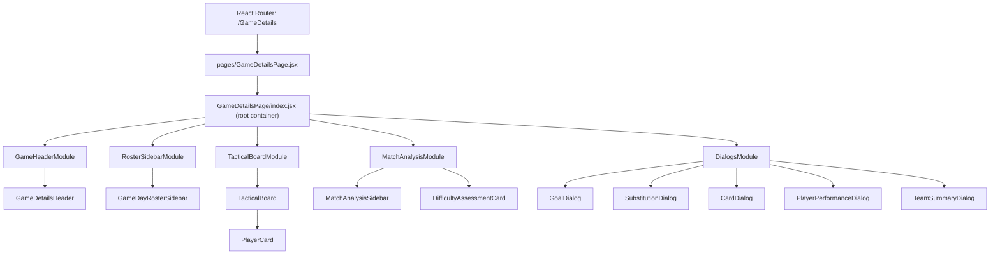

# Frontend Architecture

> **Stack:** React 18 + Vite · Feature-Sliced Design · Tailwind CSS · React Query

---

## Overview

The frontend follows **Feature-Sliced Design (FSD)** principles with ESLint-enforced module
boundaries. After a comprehensive 5-phase refactoring (December 2025 – January 2026), the
codebase exhibits professional separation of concerns, component decomposition, and clean
domain isolation.

### Key principles

- **Feature-Sliced Design** — code organized by business domain, not technical layer
- **ESLint-enforced boundaries** — features cannot import from other features; shared code lives in `shared/`
- **Component decomposition** — large components broken into focused modules and hooks
- **Separation of concerns** — UI components separate from business logic (custom hooks)

---

## Directory structure

```
frontend/src/
├── app/                    # Application layer (global setup)
│   ├── providers/          # React Query, Data, Theme providers
│   ├── router/             # Route definitions and guards
│   └── layout/             # Main layout and navigation
│
├── pages/                  # Thin page wrappers (routing layer only)
│
├── features/               # Business domains (11 features)
│   ├── game-execution/     # Live game cockpit (the most complex feature)
│   ├── game-scheduling/    # Game creation and schedule list
│   ├── analytics/          # Dashboard and statistics
│   ├── training-management/# Training session planner
│   ├── player-management/  # Player profiles + development timeline
│   ├── team-management/    # Teams and tactical boards
│   ├── drill-system/       # Drill designer and library
│   ├── reporting/          # Match reports
│   ├── settings/           # Organization configuration
│   └── user-management/    # Authentication and users
│
└── shared/                 # Reusable code across features
    ├── ui/                 # UI primitives (buttons, dialogs, forms)
    ├── api/                # Axios client + API endpoint modules
    ├── hooks/              # useAutosave, useFeature, React Query wrappers
    ├── components/         # Shared business components
    └── lib/                # Utility functions
```

---

## Game Execution feature — the flagship

The `game-execution` feature is the most architecturally rich feature in the codebase.
It is the per-game cockpit coaches use during and after a match.

### Component hierarchy



The page enforces a strict separation: **modules** (`modules/`) handle layout and pass props;
**leaf components** (`components/`) render content. Modules contain no business logic — that
lives in the 17 hooks the root container wires together.

### Custom hooks (17 total)

| Hook | Responsibility |
|------|----------------|
| `useGameDetailsData` | Loads game, derives `gamePlayers`, `matchDuration`, `finalScore`, `isReadOnly` |
| `useLineupDraftManager` | Lineup draft load + 2.5s-debounced autosave (Scheduled only) |
| `useReportDraftManager` | Report draft load + 2.5s-debounced autosave (Played only) |
| `usePlayerGrouping` | Memoized split: `playersOnPitch / benchPlayers / squadPlayers` |
| `useFormationAutoBuild` | 3-phase auto-assignment of starters to formation positions |
| `useTacticalBoardDragDrop` | Drag-and-drop on the tactical board; sets `manualFormationMode` |
| `useEntityLoading` | Parallel load: goals + subs + cards + timeline + playerStats + difficulty |
| `useGoalsHandlers` | Goal CRUD + optimistic `ourScore++` for team goals |
| `useCardsHandlers` | Card CRUD + post-mutation refresh |
| `useSubstitutionsHandlers` | Substitution CRUD + post-mutation refresh |
| `useGameStateHandlers` | All status transitions (Scheduled→Played, Played→Done, Postpone, Edit Report) |
| `useReportHandlers` | Player rating, notes, and detailed stats edits |
| `useDialogState` | 8-dialog open/close + selected-entity state |
| `useFormationHandlers` | Formation / formation-type change handlers |
| `useDifficultyHandlers` | Difficulty assessment CRUD |
| `useGameReports` | Read-mode source switching (Done vs Played) |
| `usePlayerMatchStats` | Read-mode stats source switching |

### Autosave pattern

Both the lineup (Scheduled) and report (Played) drafts use a shared `useAutosave` primitive
from `shared/hooks`. It debounces writes at 2.5 seconds and skips empty/default payloads to
avoid unnecessary network traffic.

---

## Global data layer

`DataProvider` fetches all app data from a single `/api/data/all` endpoint at startup,
providing React context with:

- `games`, `players`, `teams`, `gameRosters`, `gameReports`
- `trainingSessions`, `drills`, `formations`, `scoutReports`
- `organizationConfig` (feature flags)
- `refreshData()`, `updateGameInCache()`, `updateGameRostersInCache()` — optimistic update helpers

This single-request approach reduces initial load round-trips and is cached for 5 minutes
with background refetch on window focus.

---

## Feature flags

Organization-scoped feature flags are stored in `organization_configs` in MongoDB and
surfaced to the frontend via `organizationConfig` in the data context. The `useFeature(flagName)`
hook reads them. Currently active flags:

| Flag | Effect |
|------|--------|
| `gameDifficultyAssessmentEnabled` | Shows/hides the pre-game difficulty assessment card |
| `shotTrackingEnabled` | Enables detailed shooting stats in player match stats |
| `disciplinaryDetailEnabled` | Enables detailed foul/disciplinary ratings |

---

## Testing

- **Integration tests:** Playwright E2E covering the full game lifecycle (Scheduled → Played → Done)
- **Unit tests:** Custom hooks and utility functions with Vitest
- **Test guide:** see `frontend/TEST_GUIDE.md` and `frontend/TEST_IMPLEMENTATION_GUIDE.md`
